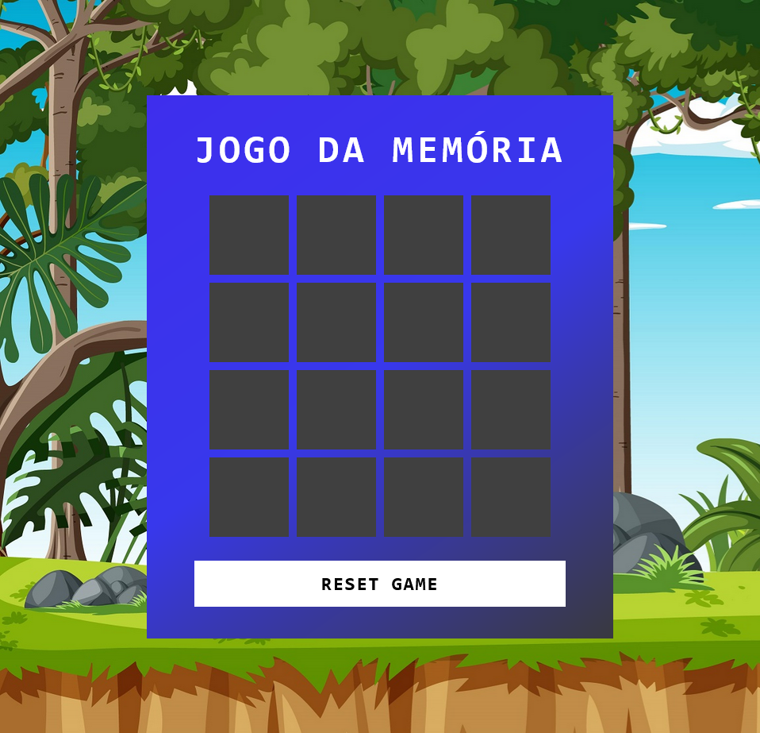
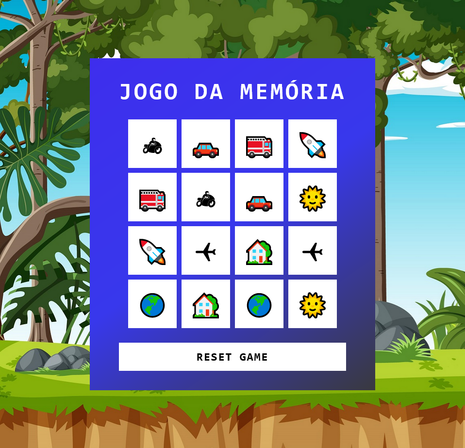

<h1 align="center">🏆 Desafio de projeto - Jogo da Memória</h1>

  
Este projeto não apenas oferece entretenimento, mas também demonstra várias técnicas avançadas de desenvolvimento de jogos em JavaScript.

<h2>Conheça o projeto clicando na imagem abaixo:</h2>

### Tecnologias Utilizadas

- HTML5 e CSS3 para a estrutura e aparência do jogo.
- JavaScript para a lógica de programação e interatividade.

### Como Jogar

1. Clone este repositório para sua máquina local.
2. Abra o arquivo `index.html` em seu navegador web.
3. Clique nas caixas para virar a carta.

### Créditos

Este jogo foi desenvolvido como parte de um projeto educacional da Digital Innovation One.